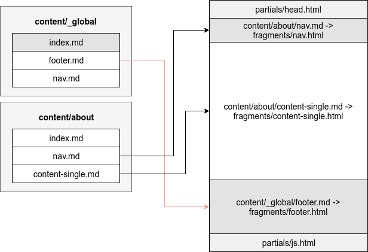

+++
fragment = "content"
weight = 100

title = "Fragments Implementation"

[sidebar]
  enable = true
+++

Fragments themselves are [Hugo partials](https://gohugo.io/templates/partials/) that are located in `layouts/partials/fragments/`.
Partials built into Syna are stored within the theme's layout directory.
Hugo enables local or per website overwrites of layouts and partials.
For more details checkout [Hugo's template lookup order](https://gohugo.io/templates/lookup-order/).

The default layout `single.html` is used to render each page. For list pages we use `list.html` layout.
**These layouts don't need to be explicitly mentioned**

The rendering code flow of Syna would do the following:

- `single.html` or `list.html` layout is called
  - The layout decides where the page directory is located (for list pages, it would be a `_index` directory next to `index.md`)
  - `helpers/fragments.html` would find all the global fragments and all the local fragments
    - The process of finding all the fragments involved destructing the path to the page
    - Locating all the `_global/` directories in the parent directories and the current directory if the current page is a list page
    - Sorting the said directories from the closest to the page to the furthest, making the local fragments and nearest `_global` directories more important
  - The helper would then remove duplicate fragments (fragments with the same name or the same directory name)
  - All the page fragments are registered in a Scratch and can later be used for various reasons
- `head.html` partial is rendered from `baseof.html` layout
- `helpers/fragments-renderer.html` is called
  - Fragments are ordered based on their `weight` attribute
  - Fragments that are not disabled are rendered (404 fragment would not be rendered in any other page than 404)
- A container for modal and React is added to the page in case there is any need for them
- `js.html` partial is rendered from `baseof.html` layout

### Creating new fragments

In order to create a custom fragment for your website create a new layout file named after your fragment and place it under `[project_root]/layouts/partials/fragments/`.
Fragments are partials and follow the same rules. If you are not familiar with partials more details are available in the [Hugo documentation](https://gohugo.io/templates/partials/).
